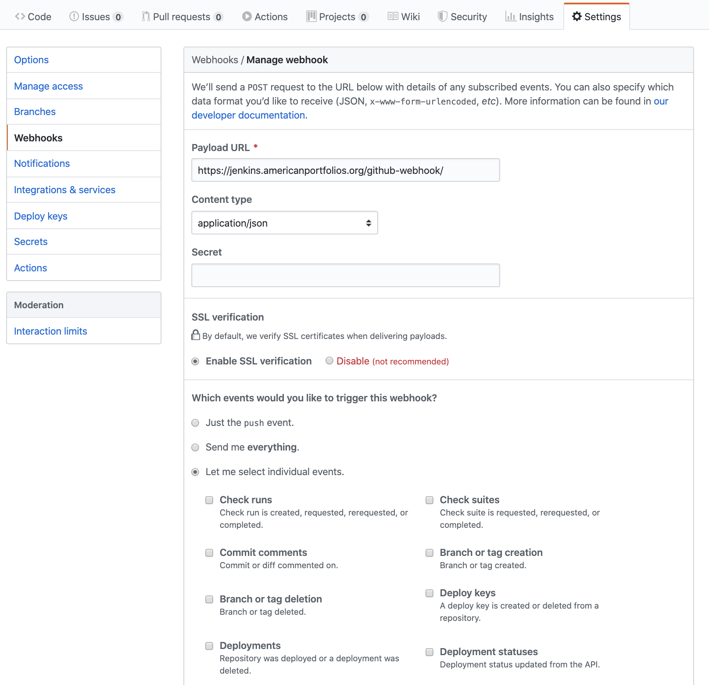
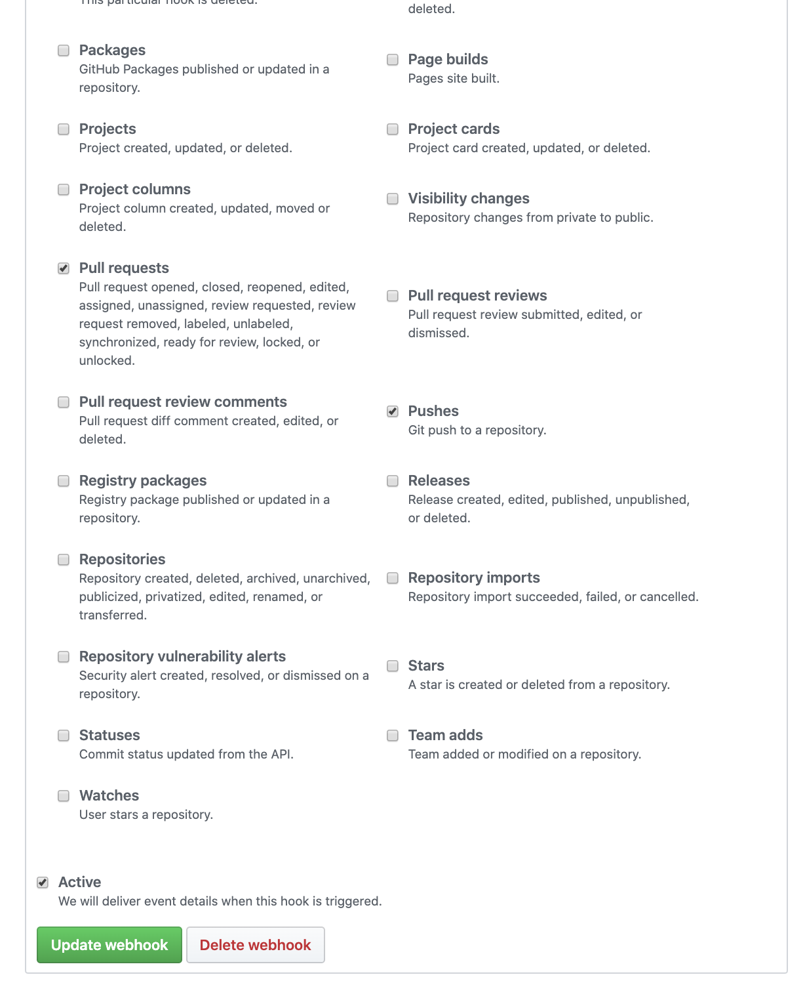

Kibana:


---
Github+Jenkins



---
```
docker build -t qzhao-v1-log-1.0.0:v1 .

docker tag qzhao-v1-log-1.0.0:v1 qingjiezhao/qzhao-v1-log:v1

docker run -d -p 8888:8888 -d --name qzhao-v1-log qingjiezhao/qzhao-v1-log:v1
```
